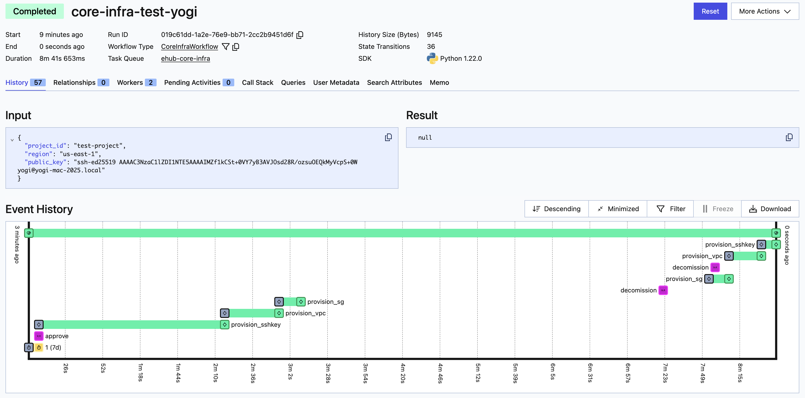
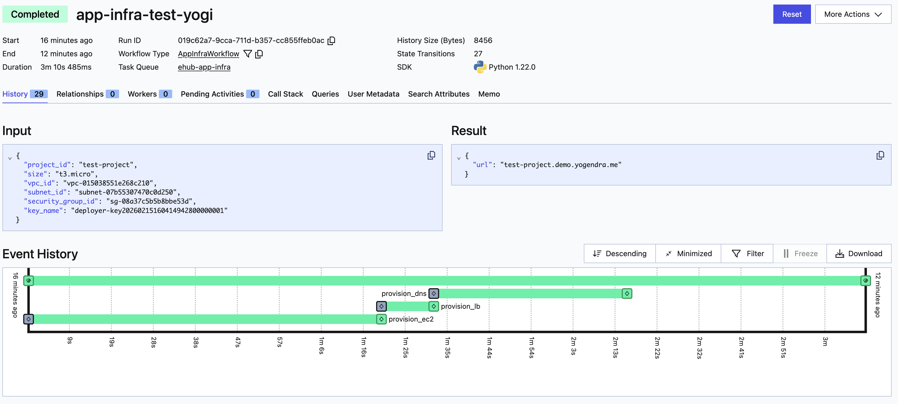

# eHub - Engineering Hub : Powere by Temporal

This is a project to demonstrate [Temporal](https://temporal.io) as engine for DevOps and CI/CD platform.


In this project has 3 parts

1. ehub-core : Core engine that powers the end-to-end workflow
2. ehub-cli : CLI for interacting with the ehub [WIP]
3. ehub-sample-project : Sample project for testing CI/CD portion of the ehub [WIP]

## Developer Guide

### Quick Start with Docker

1. Checkout code and change to directory

   ```bash
   git clone https://github.com/yogendra/ehub.git
   cd ehub
   ```

2. Prepare .env file

   Make a copy of .env.example and rename it to .env

   ```bash
   cp .env.example .env
   ```

   Provide AWS credentials in the .env file

3. Start the services

   ```bash
   docker compose up -d
   ```

   | Service       | Description                                          | Public Port | Ports      |
   | ------------- | ---------------------------------------------------- | ----------- | ---------- |
   | ehub-core     | Core engine that powers the end-to-end workflow      |             | 8080       |
   | temporal      | Temporal server for executing the workflow           | 8233        | 7233, 8233 |
   | postgres      | Postgres database for storing temporal state         |             | 5432       |
   | elasticsearch | Elasticsearch adding search capabilities in temporal |             | 9200       |

4. Open Temporal Dashboard at `http://localhost:8233`

5. Create core infrastructure

   
   1. Start deployment

      ```bash
      docker compose exec ehub-core task test:core-start
      ```

      See new workflow on temporal UI

   2. Approve deployment

      ```bash
      docker compose exec ehub-core task test:core-approve
      ```

      See the approval on temporal UI

   3. Wait for the deployment to complete

   4. Query the state of the deployment

      ```bash
      docker compose exec ehub-core task test:core-query
      ```

   5. Verify on aws console

   6. Trigger decommisioning (optional - don't run if you are going to deploy application infra. You can come back and run this after application deployment)

      ```bash
      docker compose exec ehub-core task test:core-decommission
      ```

6. Create application infrastructure

   
   1. Start deployment

      ```bash
      docker compose exec ehub-core task test:app-start
      ```

      See new workflow on temporal UI

   2. Wait for the deployment to complete

   3. Get deployed URL

      ```bash
      docker compose exec ehub-core task test:app-result
      ```

   4. Verify on aws console

7. Stop services and cleanup evenrything

   ```bash
   docker compose down -v --remove-orphans
   ```

### Quick Start on Linux / Mac

Pre-requisites

1. Install [taskfile](https://taskfile.dev/docs/installation)
2. Install [temporal](https://temporal.io/docs/cli)
3. Install [aws cli](https://aws.amazon.com/cli/)
4. Install [jq](https://stedolan.github.io/jq/download/)
5. Install [docker](https://www.docker.com/get-started/)
6. Install [git](https://git-scm.com/downloads)
7. Install [miniconda](https://docs.conda.io/en/latest/miniconda.html)

---

1. Checkout and change to directory

   ```bash
   git clone https://github.com/yogendra/ehub.git
   cd ehub
   ```

2. Create conda environment

   ```bash
   conda create -n ehub python=3.10
   ```

3. Activate conda environment

   ```bash
   conda activate ehub
   ```

4. Install dependencies (should have been done already)

   ```bash
   pip install -r requirements.txt
   ```

5. (Terminal 2) Run temporal server

   ```bash
   temporal server start-dev --ui-on
   ```

6. Run the worker

   ```bash
   task core:run
   ```

7. (Terminal 3) Create core infrastructure
   1. Create a core infra deployment

      ```bash
      task core:test:core-start
      ```

   2. Approve the deployment

      ```bash
      task core:test:core-approve
      ```

   3. Wait for the deployment to complete

   4. Query the state of the deployment

      ```bash
      task core:test:core-query
      ```

   5. Verify on aws console

   6. Trigger decommision (optional - don't run if you are going to deploy app infra)

      ```bash
      task core:test:core-decommission
      ```

8. (Terminal 3) Create application infrastructure
   1. Create a application infra deployment

      ```bash
      task core:test:app-start
      ```

   2. Wait for the deployment to complete

   3. Get deployed URL

      ```bash
      task core:test:app-result
      ```

   4. Verify on aws console

9. (Terminal 1) Stop the application

   ```bash
   Ctrl+C
   ```

10. Deactivate conda environment

    ```bash
    conda deactivate
    ```
