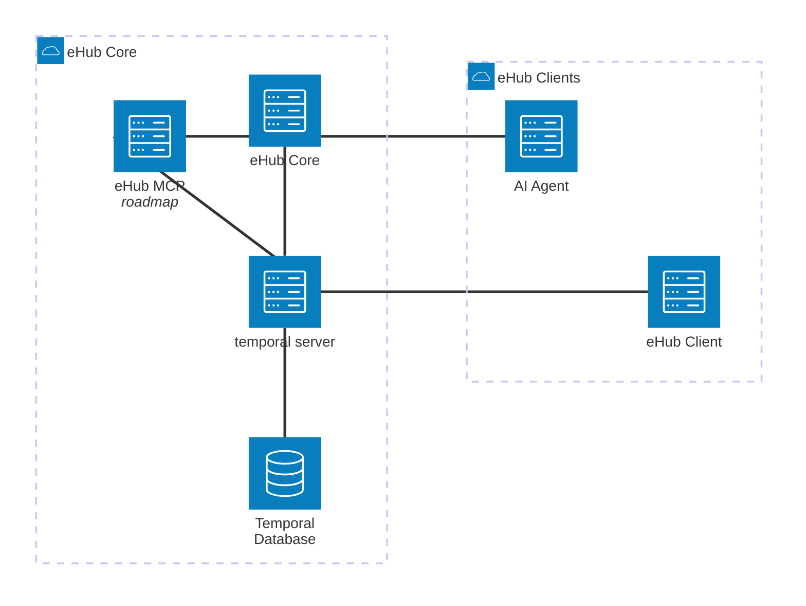

# Specification for Engineering Hub (ehub)

This is a sample project for building an engineering hub using [temporal](https://temporal.io/)

## Objectives

1. Create temporal based workflows for managing end-to-end lifecycle for software engineering projects. It includes
1. Cloud Core-Infrastructure (VPC, Subnet, Security Group, SSH, etc) Provisioning
1. Applicaiton Infra (VM, LB, DNS)
1. Use exisitng IaC tech like terraform to minimize the re-inventing
1. Be opinionated about the infra to simplify the DX.

## Scope / Limitations

1. Initially support only following Services
1. AWS EC2 - Appliction compute
1. AWS ALB - ingress
1. AWS Route53 - DNS addresses
1. Github - Source code management

## Components

1. temporal server - Central orchetrator
2. ehub-core - Core management engine. It houses the temporal workers for variouse workflows, terraform scripts used by the workflows
3. ehub-cli - command line tool for engineering to work with ehub
4. ehub-sample-project - sample project to demonstrate usage
5. ehub-mcp-server - MCP server for working with ehub using AI Agents (Cursor, Claude, Gemini, etc.) (Stretch goal)

## Architecture

## eHub Services

### Workflow: Core Infrastructure Management

- Type: Entity Workflow
- Human In Loop: Yes - Approval and VPC CIDR

Provision Cloud Core-Infrastructure (VPC, Subnet, Security Group, SSH, etc).

### Workflow: Application Infrastructure Management

- Type: Entity Workflow
- Human In Loop: No

### Workflow: CI / CD

- Type: Entity Workflow
- Human In Loop: Yes - Promote Build

## Temporal

| Workflow                 | Queue           | Description                           |
| ------------------------ | --------------- | ------------------------------------- |
| CoreInfraWorkflow        | ehub-core-infra | Core Infrastructure Management        |
| ApplicationInfraWorkflow | ehub-app-infra  | Application Infrastructure Management |
| CICDWorkflow             | ehub-cicd       | CI / CD                               |
